# Muhammad Tanveer Sultan

**Software Developer · Data Scientist · AI Engineer** &nbsp;|&nbsp; 🇵🇰 Pakistan → 🇬🇧 UK

---

## 👤 Professional Summary

Software Developer and Data Scientist with extensive experience in Python programming and machine learning. I specialize in developing scalable, maintainable software solutions and building AI-powered applications — from robust backend systems to production LLM pipelines. I excel in cross-functional collaborations, delivering innovative solutions aligned with business goals across healthcare, fintech, e-commerce, education, logistics, retail, manufacturing, and government sectors.

Committed to clean code, best practices, and continuous learning, I bring exceptional problem-solving skills, effective communication, and a strong sense of ownership to every project.

---

## 🤖 AI & LLM Engineering

Building production-grade AI applications with the latest LLM technologies:

- **LLM Integrations:** OpenAI (GPT-4/GPT-4o), Anthropic Claude, Google Gemini, and open-source models via Hugging Face — API integration, function/tool calling, and streaming responses.
- **RAG (Retrieval-Augmented Generation):** End-to-end pipelines — document ingestion, chunking, embeddings, semantic search with vector databases (Pinecone, ChromaDB, FAISS), and grounded answer generation.
- **AI Agents:** Multi-step agentic workflows with LangChain and LlamaIndex — tool use, memory, and orchestration.
- **MCP (Model Context Protocol):** Building and integrating MCP servers to connect LLMs with external tools, data sources, and APIs.
- **Prompt Engineering:** Structured outputs, few-shot prompting, and evaluation-driven prompt optimization.
- **Deployment:** Serving LLM-powered APIs with FastAPI/Django, caching with Redis, and scaling on AWS.

---

## 🛠️ Tech Stack

**Languages**

**Back-end**

**AI / Machine Learning & Data Science**

**Front-end**

**Databases**

**DevOps & Cloud**

---

## 💼 Core Skills

- **Programming Languages:** Python, JavaScript, TypeScript, SQL
- **Back-End Development:**
  - **Frameworks:** Django, Django REST Framework, FastAPI, Flask
  - **APIs:** RESTful services, GraphQL, WebSockets (Django Channels)
- **Generative AI & LLMs:**
  - **LLM Platforms:** OpenAI (GPT), Anthropic (Claude), Hugging Face Transformers
  - **Frameworks:** LangChain, LlamaIndex
  - **Techniques:** Prompt engineering, RAG pipelines, AI agents, MCP servers, fine-tuning
  - **Vector Databases:** Pinecone, ChromaDB, FAISS
- **Machine Learning & Data Science:**
  - **Frameworks/Libraries:** TensorFlow, PyTorch, Scikit-learn, Keras
  - **NLP & Computer Vision:** spaCy, NLTK, OpenCV
  - **Data Tools:** Pandas, NumPy, Matplotlib, Seaborn
- **Database Management:**
  - **SQL Databases:** PostgreSQL, MySQL, MariaDB, SQLite
  - **NoSQL Databases:** MongoDB, Redis, DynamoDB
- **DevOps & Cloud Services:**
  - **Tools:** Docker, Kubernetes, GitLab CI/CD, GitHub Actions, Jenkins, Nginx
  - **Cloud Platforms:** AWS, Azure, Google Cloud Platform
- **Asynchronous Task Management:**
  - **Task Queues:** Celery
  - **Message Brokers:** RabbitMQ, Redis
- **Front-End Development:**
  - **Frameworks/Libraries:** React.js, Next.js
  - **Styling:** Tailwind CSS, Bootstrap
- **Testing & Debugging:**
  - **Testing Frameworks:** PyTest, Jest, Selenium
  - **Debugging Tools:** Chrome DevTools, Postman
- **Version Control & Collaboration:**
  - **Systems:** Git, GitHub, GitLab, Bitbucket
  - **Project Management:** JIRA, Trello (Scrum, Kanban)
- **Other:**
  - **Web Scraping:** BeautifulSoup, Scrapy
  - **Data Visualization:** Plotly, D3.js, Power BI

---

## 🚀 How I Build & Handle Products

### 💡 *"I don't just write code — I take products from idea to impact."*

Every product I touch goes through the same battle-tested journey:

```mermaid
flowchart LR
    Start(["💡 IDEA"])
    Impact(["🌟 IMPACT"])

    subgraph P1["&nbsp;💡 DISCOVER&nbsp;"]
        A["🎯 <b>Understand</b><br/>─────────<br/>Business goal first<br/>User stories<br/>Riskiest assumptions"]
        B["📐 <b>Design</b><br/>─────────<br/>Architecture & data models<br/>API contracts<br/>Simplest thing that works"]
    end

    subgraph P2["&nbsp;🛠️ BUILD&nbsp;"]
        C["⚡ <b>Ship MVP</b><br/>─────────<br/>Small increments<br/>Real users early<br/>Fast feedback loops"]
        D["✅ <b>Quality In</b><br/>─────────<br/>Code reviews<br/>PyTest · Jest<br/>CI/CD from day one"]
    end

    subgraph P3["&nbsp;🚢 RUN & GROW&nbsp;"]
        E["📈 <b>Measure</b><br/>─────────<br/>Docker on AWS<br/>Monitoring & logging<br/>Errors · latency · usage"]
        F["🔁 <b>Iterate</b><br/>─────────<br/>Data-driven decisions<br/>Honest trade-offs<br/>Relentless improvement"]
    end

    Start ==> A ==> B ==> C ==> D ==> E ==> F ==> Impact
    F -. "🔄 learn & repeat" .-> A

    classDef milestone fill:#bf8700,stroke:#d4a72c,color:#ffffff,stroke-width:3px,font-weight:bold
    classDef understand fill:#1f6feb,stroke:#388bfd,color:#ffffff,stroke-width:2px
    classDef design fill:#8250df,stroke:#a371f7,color:#ffffff,stroke-width:2px
    classDef ship fill:#e16f24,stroke:#f0883e,color:#ffffff,stroke-width:2px
    classDef quality fill:#1a7f37,stroke:#2ea043,color:#ffffff,stroke-width:2px
    classDef measure fill:#0f7b8a,stroke:#39c5cf,color:#ffffff,stroke-width:2px
    classDef iterate fill:#cf222e,stroke:#ff7b72,color:#ffffff,stroke-width:2px
    classDef phase fill:transparent,stroke:#8b949e,stroke-width:1.5px,stroke-dasharray:6 4,color:#8b949e

    class Start,Impact milestone
    class A understand
    class B design
    class C ship
    class D quality
    class E measure
    class F iterate
    class P1,P2,P3 phase

    linkStyle 0,1,2,3,4,5,6 stroke:#58a6ff,stroke-width:3px
    linkStyle 7 stroke:#ff7b72,stroke-width:2.5px
```

### 🧭 The principles behind every arrow

| | Principle | What it means in practice |
|---|---|---|
| 🎯 | **Users over features** | If it doesn't solve a real problem, it doesn't get built. |
| ⚡ | **Shipped beats perfect** | A working MVP in users' hands teaches more than a month of planning. |
| ✅ | **Quality is built in, not bolted on** | Tests, reviews, and CI/CD from commit #1 — speed without fragility. |
| 📊 | **Data decides, not opinions** | Production metrics and user behavior drive every next move. |
| 🤝 | **Own it end to end** | From the first stakeholder conversation to 2 AM production support — it's mine. |

**understand deeply → design simply → ship early → test everything → measure honestly → iterate relentlessly**

---

## 🎓 Education

- **2024:** MSc Advanced Data Science — Bangor University, UK
- **2016–2020:** BS Computer Science (BSCS — 3.89 CGPA)

---

## 🌱 Interests & Current Focus

- **Learning:** Large Language Models, prompt engineering, AI agent frameworks, MLOps, advanced deep learning, NLP, and computer vision.
- **Interested in:** Generative AI advancements, scalable backend/frontend engineering, and AI-driven full-stack development for healthcare, fintech, e-commerce, education, logistics, retail, manufacturing, and government.
- **Open to collaborate on:** Open-source ML and generative AI projects, LLM-powered products (chatbots, AI agents, RAG pipelines), interactive data visualization tools, and full-stack applications combining Django/FastAPI with React.js.

---

## ⚡ Fun Facts

- 🧠 I ask AI models more questions per day than I ask humans — and I'm building apps so everyone else can too.
- 🌍 I've written code that runs in healthcare, fintech, e-commerce, and logistics — same language (Python), very different bugs.
- 📊 From my MSc in Data Science I learned the most important lesson in ML: 80% of the work is cleaning the data. The other 20% is explaining why the model was wrong.
- ☕ My debugging stack: coffee, print statements, and *then* the debugger.

---

## 📫 Contact

- **Email:** [engr.tanveersultan53@gmail.com](mailto:engr.tanveersultan53@gmail.com)
- **GitHub:** [@tanveersultan53](https://github.com/tanveersultan53)
- **LinkedIn:** [Muhammad Tanveer Sultan](https://www.linkedin.com/in/muhammad-tanveer-sultan-bb3a90166/)
- **Medium:** [@engr.tanveersultan53](https://medium.com/@engr.tanveersultan53)
- **Kaggle:** [@sultan53](https://www.kaggle.com/sultan53)
